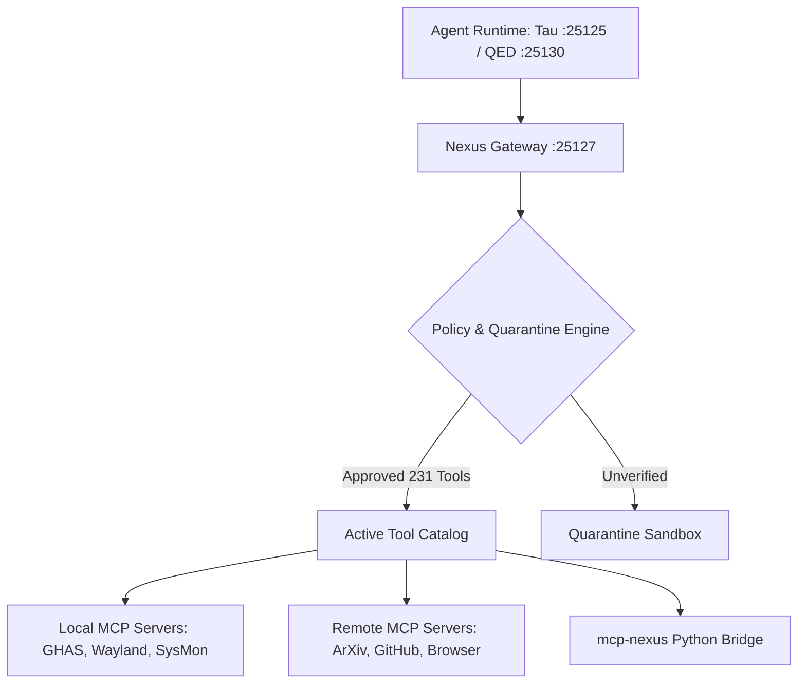

# Nexus (mcpproxy-go)

> **The sovereign MCP tool federation, security firewall, and agent gateway. Connects 231+ tools across 18 servers with zero token bloat.**  
> Canonical Lineage: **[toxicwind/mcpproxy-go](https://github.com/toxicwind/mcpproxy-go)** & **[toxicwind/nexus](https://github.com/toxicwind/nexus)** (Upstream: [smart-mcp-proxy/mcpproxy-go](https://github.com/smart-mcp-proxy/mcpproxy-go))

[](https://github.com/toxicwind/mcpproxy-go/actions)
[](LICENSE)

---

## 🔱 Why Nexus?

Where individual agents choke on tool limits (Cursor 40-tool ceiling, OpenAI 128-tool limit) or burn thousands of tokens transmitting full JSON schemas every turn, Nexus provides:
- **Universal Federation**: A single standard HTTP endpoint (`http://127.0.0.1:25127/mcp`) exposing all federated tools.
- **Dynamic Tool Indexing**: Semantic tool retrieval reducing context overhead by up to **99%**.
- **Security Quarantine**: Automated tool poisoning defense and policy governance.
- **Consolidated Automation**: Includes the complete `mcp-nexus` multi-tool orchestration suite (`contrib/mcp-nexus/`).

---

## 🏛️ Architecture



---

## ⚡ Quick Start

```bash
# Build binary with Zen 4 optimization
go build -v -ldflags="-s -w" -o mcpproxy .
./mcpproxy --config /home/toxic/sovereign/config/mcpproxy.json
```
