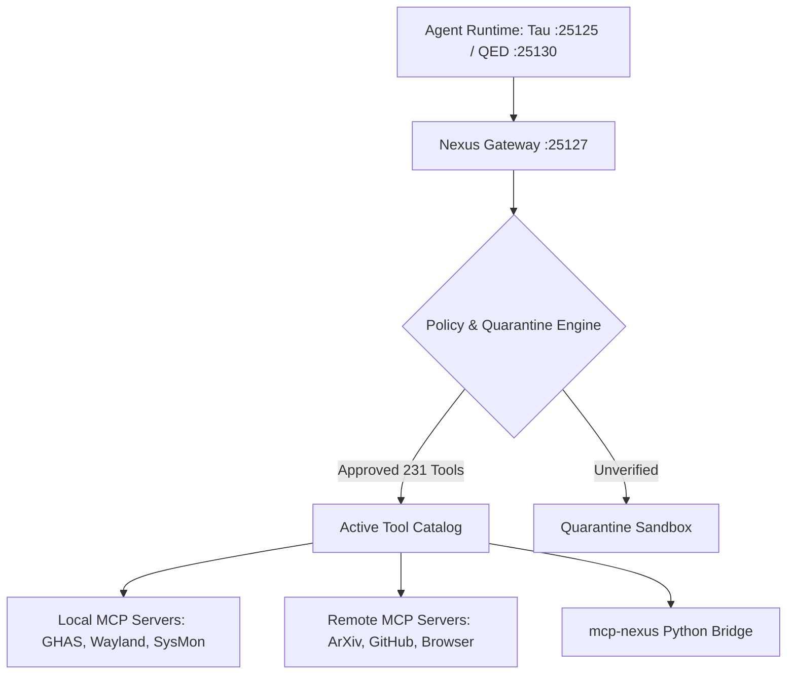

# Nexus (mcpproxy-go)

<div align="right">

[](https://github.com/toxicwind/mcpproxy-go/actions)
[](LICENSE)
[](go.mod)

</div>

> **The sovereign MCP tool federation, security firewall, and agent gateway. 231+ tools across 18 servers behind one endpoint — with zero token bloat.**

Canonical lineage: **[toxicwind/mcpproxy-go](https://github.com/toxicwind/mcpproxy-go)** & **[toxicwind/nexus](https://github.com/toxicwind/nexus)**
(upstream: [smart-mcp-proxy/mcpproxy-go](https://github.com/smart-mcp-proxy/mcpproxy-go))

---

## 🔱 Why Nexus?

Where individual agents choke on tool limits (Cursor's 40-tool ceiling, OpenAI's 128-tool limit) or burn thousands of tokens transmitting full JSON schemas every turn, Nexus provides:

- **Universal Federation** — a single standard HTTP endpoint (`http://127.0.0.1:25127/mcp`) exposing every federated tool
- **Dynamic Tool Indexing** — BM25 semantic tool retrieval that cuts context overhead by up to **99%**
- **Security Quarantine** — automated tool-poisoning defense and policy governance
- **Consolidated Automation** — the complete `mcp-nexus` multi-tool orchestration suite ([`contrib/mcp-nexus/`](contrib/mcp-nexus/))

## ✨ Features

- 🔍 **Intelligent tool discovery** — BM25 index across all connected servers; the client queries for relevant tools and receives only what it needs
- 🛡️ **Security quarantine** — new servers are quarantined until manually approved; blocks Tool Poisoning Attacks (TPA) via crafted tool descriptions
- 🐳 **Docker isolation** — run upstream MCP servers in containers with automatic runtime detection (Python/Node.js) and env passing
- 📋 **Audit & transparency** — full logging of every tool call for debugging and compliance
- 🔑 **Sensitive-data detection** — automatic detection of API keys, credentials, PII, and other sensitive data in tool calls
- 🖥️ **Multiple control interfaces** — full CLI for scripting, browser-based Web UI dashboard, and system-tray app (macOS/Windows/Linux)
- 🐍 **mcp-nexus bridge** — Python orchestration suite (`contrib/mcp-nexus/`: `mcp_nexus`, `pyproject.toml`, Docker, scripts)

## 🏛️ Architecture


```mermaid
graph TD
    A[Agent Runtime: Tau :25125 / QED :25130] --> B[Nexus Gateway :25127]
    B --> C{Policy & Quarantine Engine}
    C -->|Approved 231 Tools| D[Active Tool Catalog]
    C -->|Unverified| E[Quarantine Sandbox]
    D --> F[Local MCP Servers: GHAS, Wayland, SysMon]
    D --> G[Remote MCP Servers: ArXiv, GitHub, Browser]
    D --> H[mcp-nexus Python Bridge]
```

Two components, one repo:

| Component | Binary | Role |
|---|---|---|
| Core server | `mcpproxy` (`cmd/mcpproxy`) | Headless HTTP API server with MCP proxy functionality. Binds `127.0.0.1:8080` by default (localhost-only for security); the sovereign mesh serves the federation at `:25127/mcp` ([`config/mesh_config.json`](config/mesh_config.json)) |
| Tray app | `mcpproxy-tray` (`cmd/mcpproxy-tray`) | Optional GUI that manages the core server |

The engine room is [`internal/`](internal): `security`, `sandbox`, `audit`, `auth`, `index` (tool discovery), `transport`, `upstream`, `registries`, `telemetry`, `observability`, `outputvalidation`, `toolsig`, `secret` — quarantine policy, tool signing, and audit trails all live here as first-class packages.

## ⚡ Quick Start

```bash
go build -v -ldflags="-s -w" -o mcpproxy .
./mcpproxy --config /home/toxic/sovereign/config/mcpproxy.json
```

That's it: the gateway comes up on `127.0.0.1:25127/mcp` with the full federated catalog behind it.

## ⚙️ Configuration & services

- **[docs/configuration.md](docs/configuration.md)** — full config reference; **[docs/configuration/](docs/configuration/)** — per-area guides
- **[docs/cli-management-commands.md](docs/cli-management-commands.md)** — manage servers, tools, and quarantine from the CLI
- **[docs/docker-isolation.md](docs/docker-isolation.md)** — containerized MCP servers: runtime detection, env passing, lifecycle
- **Web UI** — browser dashboard for visual management ([`frontend/`](frontend/), [`web/`](web/))
- **Tray app** — `mcpproxy-tray`: quick access on macOS/Windows/Linux
- **[docs/getting-started/installation.md](docs/getting-started/installation.md)** — DMG/Windows installers, Docker, native builds (incl. macOS and Windows installer research in `docs/`)

## 🛠️ Development

```bash
make build   # swagger + frontend + server
make test    # full test suite
```

- **Stack:** Go 1.26 (`go.mod`), TypeScript frontend, OpenAPI (`oas/`, `make swagger`)
- **Contributing:** [CONTRIBUTING.md](CONTRIBUTING.md); dev guides under [docs/development/](docs/development/)
- **Specs:** [specs/](specs/) (numbered feature specs); **E2E:** [e2e/](e2e/) + [docs/E2E_TESTING.md](docs/E2E_TESTING.md); **bench:** [bench/](bench/)
- **Packaging:** [packaging/](packaging/), [wix/](wix/) (Windows installer), [Dockerfile](Dockerfile) + [docker/](docker/)

## 📄 License & security

- **License:** [MIT](LICENSE) — © 2025 mcpproxy-go contributors
- **Security:** quarantine-by-default for new servers, constant audit logging, and automatic sensitive-data detection in tool calls. This repo ships no standalone `SECURITY.md`; the quarantine policy and audit packages under [`internal/`](internal) are the enforcement surface — treat tool descriptions as untrusted input.
